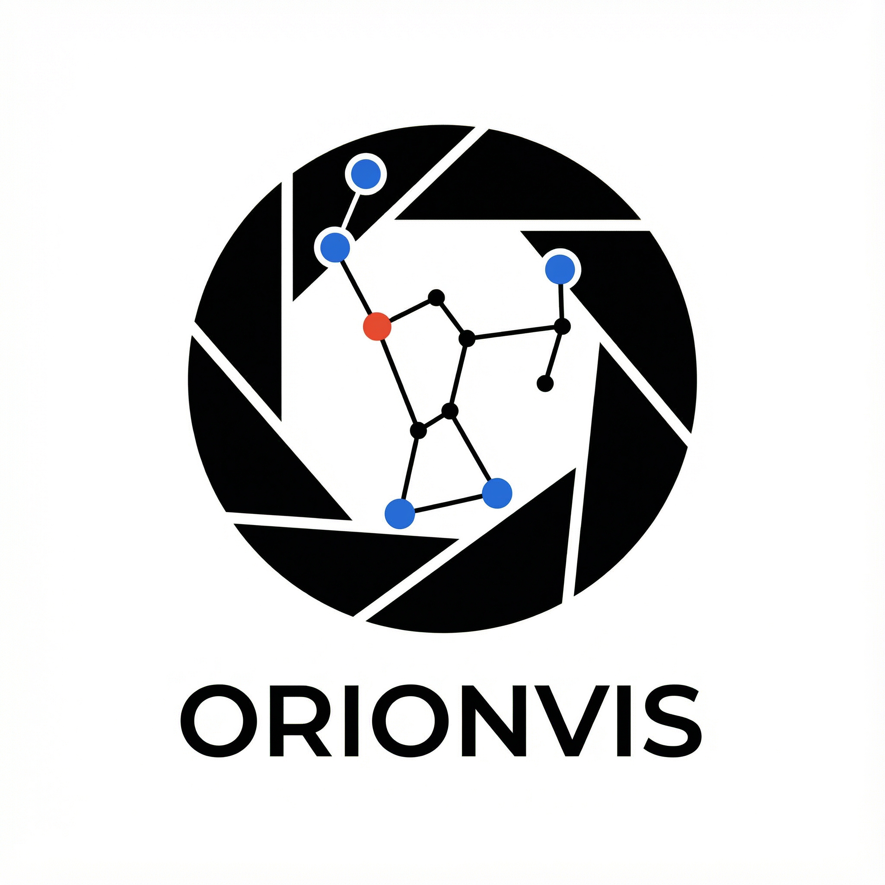

<div align="center">


# orionvis

A PyTorch‑friendly Computer Vision toolkit for unified backbone loading, YAML‑based weights, and registered preprocessing.

[](https://www.python.org/)
[](https://www.apache.org/licenses/LICENSE-2.0)
[](#)
[](https://github.com/bluemoon-o2/models/issues)

</div>

## Overview
orionvis streamlines common CV workflows in PyTorch: load backbones with a single call, manage pretrained weights via YAML with lazy indexing, and apply registered transforms for classification inference. It consolidates model, weight, and preprocessing logic while staying lightweight and production‑ready.


## Features
- Unified backbone loader: `resnet*`, `dino*`, `mobilemamba_*`.
- YAML‑based weights with cached index and lazy loading.
- Transform registry (e.g., `ImageClassification`) for ready‑to‑use preprocessing.
- Feature extraction helpers and utilities.

## Installation
```bash
pip install orionvis
```
For local development:
```bash
git clone https://github.com/bluemoon-o2/models
cd models
pip install -e .
```

## Quickstart
```python
import orionvis

# Load a backbone with pretrained weights
model = orionvis.load("mobilemamba_b1s", pretrained=True)

# Retrieve weight metadata and preprocessing transform
weight = orionvis.get_weights("mobilemamba_b1s")
transform = orionvis.api.WeightsRegistry().get_transform("mobilemamba_b1s")

# Example: preprocess an input PIL image
# img = transform(img)
# logits = model(img.unsqueeze(0))
```

## Models
- Programmatic list: `orionvis.api.WeightsRegistry().list_models()`
- Included backbones: `resnet18`…`resnet152`, `resnext*`, `wide_resnet*`, `dinov2_*`, `dinov3_*`, `mobilemamba_*`.

## Weights
- Config path: `orionvis/configs/weights/mobilemamba.yaml` (multi‑document YAML; one model per document).
- Download path cache: `~/.cache/gdown` (configurable via `ORIONVIS_CACHE`).

## License
Apache License 2.0. See the license text: https://www.apache.org/licenses/LICENSE-2.0

## Citation
```
@article{mobilemamba,
  title={MobileMamba: Lightweight Multi-Receptive Visual Mamba Network},
  author={Haoyang He and Jiangning Zhang and Yuxuan Cai and Hongxu Chen and Xiaobin Hu and Zhenye Gan and Yabiao Wang and Chengjie Wang and Yunsheng Wu and Lei Xie},
  journal={arXiv preprint arXiv:2411.15941},
  year={2024}
}
```

## References
- [torchvision](https://github.com/pytorch/vision)
- [DINOv2](https://github.com/facebookresearch/dinov2)
- [DINOv3](https://github.com/facebookresearch/dinov3)
- [MobileMamba](https://github.com/lewandofskee/MobileMamba)
